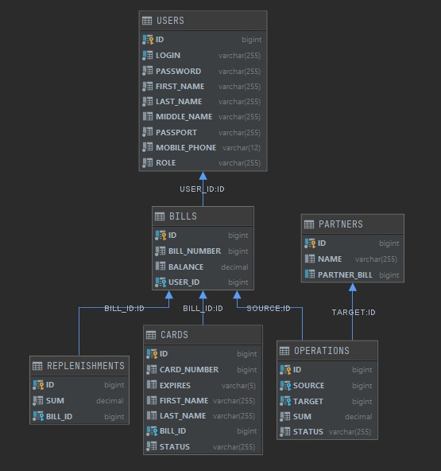

#BankApi
***
##Краткое описание
- Веб-сервис, реализующий логику работы клиентов с банковскими счетами
- jar архив находится в "out/artifacts/BankApi_jar"
- для запуска приложения из консоли прописать "java -jar BankApi.jar"
- настройки порта и url подключения к бд нахоядтся в "src/main/resources/property/property"
***
##Stack
- ###jackson
- ###h2database
- ###jbcrypt
- ###junit5
- ###mockito
***
##Er-diagram

***
##API

###/api/user
```
/bills                      GET             returns all user bills  
```
```
/bills?id=                  GET             returns bill info for bill id 
```
```
/cards?billId=              GET             returns all cards for bill id
```
```
/cards?id=                  GET             returns all info about cardb for id
```
```
/cards?billid=              POST            create card by bill id	
```
```
/balance?billId=            GET             returns balance of bill		
```
```
/replenisments?billId=      GET             returns balance of bill		
```
```
/replenisments              POST            create replenishment			
```
```
/partners                   GET             returns all partners		
```
```
/partners                   POST            adds new partner			
```
```
/operations                 POST            create operation to partner		
```
```
/operations?billid=         POST            returns list of operations by bill id	
```

###/api/employee
```
/operations                 GET             returns all operations			
```
```
/operations?status=         GET             returns all operations with some status	
```
```
/operations?id=&action=     PUT             changes status for operation
```
```
/cards                      GET             returns all cards
```
```
/cards?status=              GET             returns all cards with some status	
```
```
/cards?id=&action=          PUT             changes status for card	
```
```
/users                      POST            creates user	
```
```
/bills?id=                  POST            creates bill by user id	
```
***
##POST JSON
####USER
```
{   
    "login" : "admin",
    "password" : "admin",
    "firstName" : "Vitaliy",
    "lastName" : "Kairachka",
    "middleName" : "Alekseevich",
    "passport" : "1234",
    "mobilePhone" : "89999999999"
}
```
####REPLENISHMENT
```
{
    "sum" : 100.0,
    "billId" : 1
}
```
####PARTNER
```
{
    "name" : "Igor",
    "partnerBill" : 2000000000000000001
}
```
####OPERATION
```
{
    "sourceId" : 1,
    "targetId" : 2,
    "sum" : 100
}
```